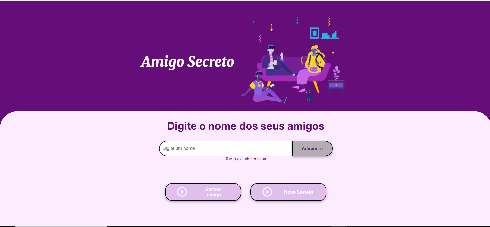

# 🎁 Amigo Secreto - Challenge Alura + Oracle

Um projeto interativo e divertido para sortear amigos secretos desenvolvido com HTML, CSS e JavaScript.


## ✨ Como funciona o jogo
[

### 🎯 Objetivo

Sortear aleatoriamente um amigo secreto entre os participantes cadastrados.

### 📋 Passo a passo para usar:

1. **Adicione participantes**: Digite o nome de cada pessoa no campo de texto
2. **Confirmação**: Clique em "Adicionar" ou pressione Enter
3. **Visualize a lista**: Todos os nomes aparecerão na lista abaixo
4. **Sortear**: Quando tiver pelo menos 2 pessoas, clique em "Sortear amigo"
5. **Resultado**: O nome sorteado aparecerá com uma animação especial
6. **Novo sorteio**: Use "Novo Sorteio" para reiniciar o jogo

### ⚡ Funcionalidades

- ✅ **Validação de entrada**: Impede nomes vazios ou duplicados
- ✅ **Interface responsiva**: Funciona em celular, tablet e computador
- ✅ **Tecla Enter**: Adiciona nomes pressionando Enter
- ✅ **Remoção individual**: Clique no × para remover alguém da lista
- ✅ **Contador em tempo real**: Mostra quantos amigos foram adicionados
- ✅ **Animações**: Efeitos visuais para melhor experiência
- ✅ **Alertas personalizados**: Mensagens amigáveis para o usuário

### 🎨 Design

- **Cores vibrantes**: Tema em roxo e tons complementares
- **Fontes modernas**: Inter e Merriweather do Google Fonts
- **Ícones intuitivos**: Botões com ícones para melhor entendimento
- **Layout limpo**: Interface organizada e fácil de usar

## 🚀 Tecnologias utilizadas

- **HTML5**: Estrutura semântica
- **CSS3**: Estilização com variáveis e flexbox
- **JavaScript**: Lógica e interatividade
- **SweetAlert2**: Alertas personalizados
- **Google Fonts**: Tipografia moderna

## 📱 Compatibilidade

- ✅ Chrome, Firefox, Edge, Safari
- ✅ Celulares Android e iPhone
- ✅ Tablets e dispositivos móveis
- ✅ Computadores desktop

## 🎯 Como executar

1. Faça o download dos arquivos
2. Abra o arquivo `index.html` no navegador
3. Comece a adicionar nomes e divirta-se!

## 🔧 Personalização

```css
:root {
  --color-primary: #650d79;
  --color-secondary: #fdebff;
  --color-button: #59305d;
}
```
